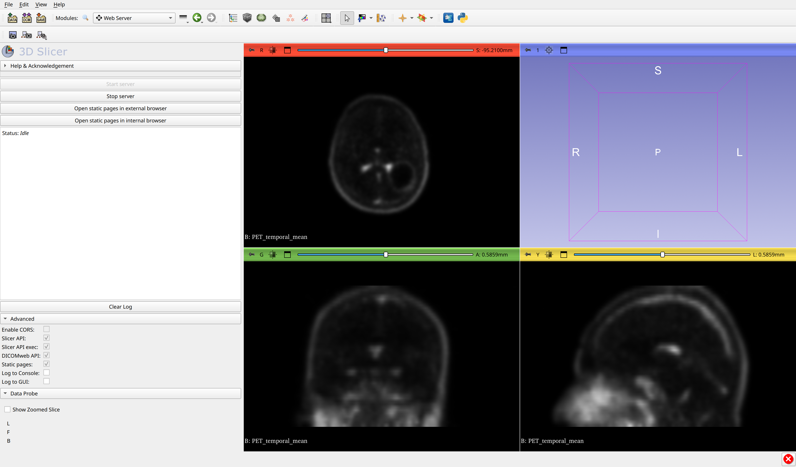
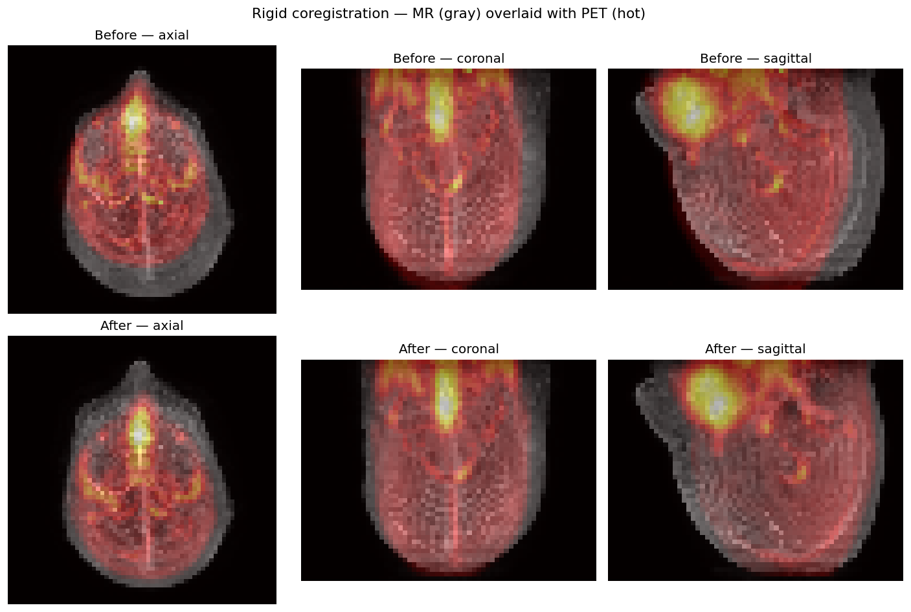

**Repository.** `https://github.com/AlejandroB10/BrainScope`
(public; you can read the README and browse the layout from there).

# 1. What the project is about

The plan is to implement the three objectives of the proposal on a single
brain study made of a dynamic PET (`e_1_BRAIN_DINAMIC_COLINA`) and a MR
T1 (`AX_3D_T1`): load and visualize the DICOMs, rigidly coregister the
temporally averaged PET onto the MR, and segment the tumor visible on the
last PET frame with one of the AI models suggested in the proposal. The
architecture stays small on purpose: one Python module per objective, the
course conda environment `medical-image-processing-11763`, and a bridge
to 3D Slicer through the `mcp-slicer` MCP server for live qualitative
inspection.

# 2. Where I am right now

I went a bit further than I had planned for the intermediate. Objective 1
is essentially complete and Objective 2 has a working coregistration
pipeline. Objective 3 hasn't started yet.

**Objective 1.** `src/loading.py` reads both DICOMs, reshapes the flat
`(1692, 256, 256)` `int16` PET array into `(36 frames, 47 slices, 256,
256)`, computes the temporal mean and the last frame, and saves three
artifacts under `docs/figures/`: a static composite of the median planes
for the last frame and the temporal mean, the same composite for the MR
T1, and a 36-frame GIF that sweeps the three median planes across time.
The reshape order was confirmed against `FramePositionsVector` (every z
position appears once per temporal frame) and validated visually by
reloading the result into 3D Slicer through the MCP bridge: the temporal
mean reads as a recognisable brain (Figure 1).

{width=58%}

`src/coregistration.py` covers the **Objective 2** pipeline end-to-end. It
implements a rigid model with translation plus axial rotation around the
volume centre (Rodrigues), a Mutual Information loss computed from a
32-bin joint histogram, and an optimisation driver that calls
`scipy.optimize.minimize` with the Powell method. Running it on a
downsampled `(48, 64, 64)` grid (the speed-vs-physics compromise I
describe below) takes ~10 seconds and moves Mutual Information from
`0.408` (identity init) to `0.526` (Figure 2).

{width=58%}

**Objective 3** hasn't begun yet. It's parked behind the model choice,
which I cover in the open questions.

A few things on the to-do list. The rotating-MIP animation of Objective
2.b is not yet done. The registration runs on voxel space after isotropic
downsampling; the full pipeline must pull the PET / MR voxel-to-physical
affines from the DICOM headers and resample on a common physical grid
(top of the list after this submission). The Objective 3 mask
propagation, the inverse transform, and the numerical coregistration
assessment are all parked behind the Objective 3 work.

# 3. How I'm planning to attack the rest

The Objective 2 cleanup comes first: build voxel-to-physical affines from
`ImagePositionPatient` / `ImageOrientationPatient` / `PixelSpacing` /
`SpacingBetweenSlices`, resample PET onto the MR grid in physical
coordinates, rerun the MI optimisation there. Once that lands, the
rotating MIP animation drops out almost for free. Objective 3 then runs
the chosen AI model on the MR side, prompted by a bounding box placed
manually in 3D Slicer, and the resulting mask is propagated back to the
PET space via the inverse rigid.

# 4. Risks I'm watching

| Risk                                                          | Mitigation                                                              |
|---------------------------------------------------------------|-------------------------------------------------------------------------|
| Voxel-space registration hides physical mismatches            | Switch to physical-coordinate registration before the final submission   |
| Mutual Information local maxima                               | Multi-start initialisation; PyElastix as a sanity check                  |
| AI segmentation model too heavy for the local hardware        | Pre-screen models; classical region growing as fallback                 |
| Time pressure on Objective 3                                  | Keep the rotating-MIP polish minimal so the model work has runway        |

The list of open questions on the next pages is the input I need from
you to lock those decisions before going further.

\newpage

# Open questions

These are the points where I'd like input before committing to an approach.
Grouped by stage, ordered roughly by impact on the final grade.

## Objective 1 — DICOM loading and visualization

1. **Slice ordering of the dynamic PET.** I'm using
   `(0055, 1002)` Frame Positions Vector, but the file also exposes
   `ImagePositionPatient` per slice. I confirmed against
   `FramePositionsVector` that every z position appears once per frame.
   In your experience, are there scanners where Frame Positions Vector and
   `ImagePositionPatient` disagree, and would you trust either one as the
   ground truth?

2. **Temporal aggregate for the coregistration input.** Right now I'm
   using a plain unweighted mean across the 36 frames. Frame durations
   range from 5 s to 300 s, so a duration-weighted mean would emphasise
   the late frames. Is the unweighted mean fine, or do you prefer the
   weighted one?

3. **Intensity scale for the GIF.** I lock `vmax` at the 99.5 percentile
   of the whole 4D volume and reuse it across frames so the early-frame
   wash-in vs. late-frame plateau remains visible. Does that match what
   you usually expect?

## Objective 2 — 3D rigid coregistration

4. **Custom vs. PyElastix.** My implementation is from scratch (rigid +
   MI + Powell). I plan to keep it that way and only use PyElastix as a
   sanity check. Does that match the spirit of the assignment?

5. **Loss function.** I'm on Mutual Information with a 32-bin joint
   histogram. Would you push for normalised MI or normalised cross
   correlation on PET vs. MR specifically, or is plain MI good enough?

6. **Initial rotation prior.** I currently start from the identity
   (zero translation, zero rotation). For a same-session study this seems
   safe, but a PCA-based principal-axes alignment might bring the
   optimiser closer to the global maximum. Worth doing, or overkill?

7. **What to report numerically.** Right now I report MI before / after.
   What's the figure of merit you'd like to see in the final report?
   Final MI, residual landmark distances, target registration error from
   Slicer-placed fiducials, or a combination?

8. **Voxel-space shortcut.** The current pipeline registers in voxel
   space after isotropic downsampling. Lifting it to physical-coordinate
   registration is on my plate. Is doing both versions (voxel and
   physical) something you'd value as a discussion in the final document,
   or do you prefer just the physical one with the voxel one dropped from
   the report?

## Objective 3 — 3D image segmentation

9. **Model recommendation.** Among nnInteractive, SAMed-2, SAT, and
   MedSAM2, which one would you pick as the default for brain tumors on
   PET / MR T1? Hardware-wise I have one consumer-grade GPU, which I
   think rules out the heaviest configurations.

10. **Modality the model sees.** Do you expect the model to run on the
    MR volume, on the coregistered PET, or on a fused channel? The
    decision really changes how I structure Objective 3.

11. **Reference mask.** Is there a ground-truth tumor mask available for
    this study? If yes, I'd compute Dice / Jaccard / Hausdorff. If not,
    I'll fall back to volume / sphericity / qualitative comparison and
    document the limitation.

12. **Bounding box workflow.** For the manual bounding box step, is a
    hard-coded tuple (taken once from a 3D Slicer inspection) acceptable,
    or do you want an interactive widget inside the report notebook?

## General / submission

13. **Notebook vs. scripts.** Activities use `__main__` scripts. For the
    final 5-page summary, do you prefer a single Jupyter notebook that
    orchestrates everything, or modular scripts referenced from the doc?

14. **Reproducibility data.** The DICOMs are out of git because of size.
    Is a `data/README.md` with download instructions enough for the
    "publicly accessible" criterion, or should I host a sample subset?

15. **3D Slicer evidence.** I'm wiring up an MCP bridge to drive Slicer
    programmatically (already used to validate the PET reshape, see
    Figure 1). Does that count as the "third-party DICOM visualizer"
    Objective 1.b asks for, or do you expect manual GUI screenshots in
    the final report too?
